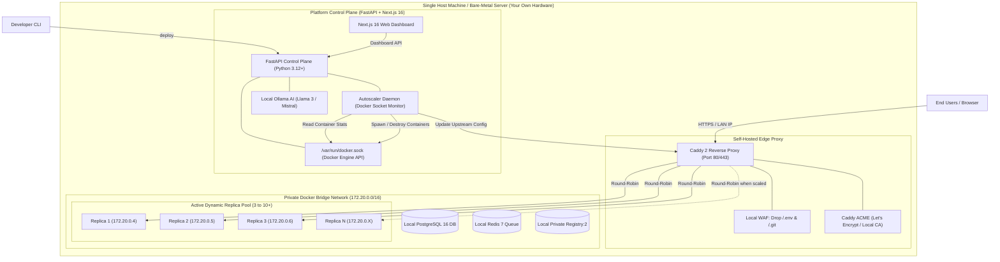
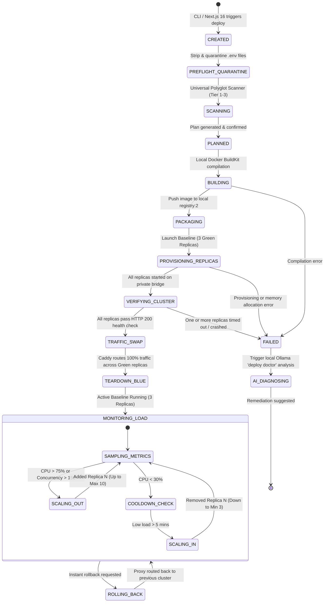
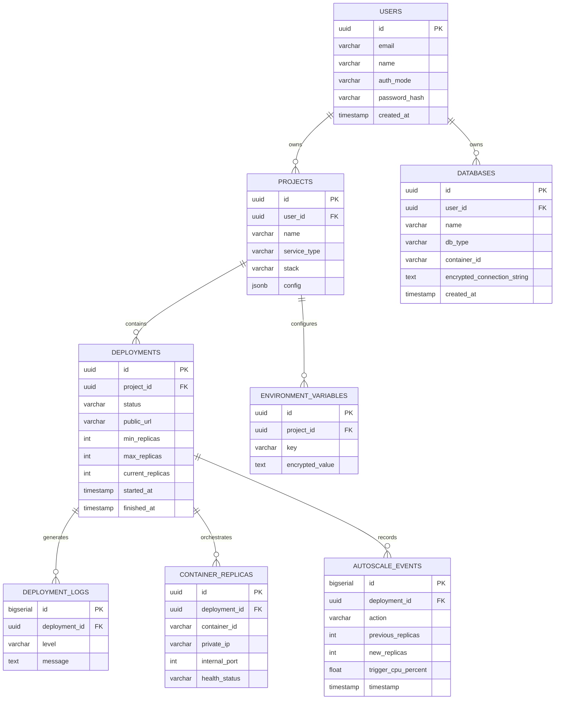

# CLI Cloud Deployment Platform
### Project Workflow + Technical Documentation
> *“Turn Any Server into Your Personal Vercel + Render — 100% Self-Hosted, Zero External Dependencies.”*

---

| Attribute | Details |
| :--- | :--- |
| **Project Type** | 100% Self-Hosted Universal Cloud Deployment Platform (Self-Contained Private Cloud PAAS) |
| **Primary Goal** | Detect → Configure → Build → Deploy → Auto-Scale → Return Public / Local URL |
| **Infrastructure Model**| **100% Self-Hosted / On-Premise**: Runs entirely on your own hardware, dedicated Linux server, home lab, or college lab server — **Zero external cloud servers (No AWS, No GCP, No Vercel, No Render API dependencies)** |
| **Autoscaling Engine**| **Dynamic Horizontal Autoscaling (HPA)**: Starts at 3 replicas baseline (HA), automatically scales out to 10+ replicas under load, and scales down during quiet periods |
| **Stack Support** | **Universal Polyglot Engine**: 100% support for **ANY** tech stack (Node.js, Next.js, Python, Go, Rust, Java, PHP, Ruby, .NET, Bun, Deno, Static sites, or custom Dockerfile) |
| **Platform Vision** | **Vercel-Style** Frontend & SSR Hosting + **Render-Style** Containerized Web Services, Workers & Managed Databases on your own server |
| **Authentication** | **OAuth 2.0 Social Login** (Google & GitHub) + Optional Local Self-Hosted Admin Login for air-gapped/offline networks |
| **AI Diagnostics** | **Self-Hosted AI Doctor (`deploy doctor`)**: Powered by local LLM via **Ollama (Llama 3 / Mistral)** with optional cloud API fallback |
| **Backend Core Stack** | **Python 3.12+ & FastAPI** (Async ASGI, Pydantic v2, SQLAlchemy 2.0 Async, ARQ/Redis) |
| **Frontend / Dashboard**| **Next.js 16 (Turbopack, App Router, React 19)** + Tailwind CSS + TypeScript |
| **Target Users** | Student developers, college labs, privacy-first companies, self-hosters, and dev teams |
| **Primary Interface** | Terminal / VS Code Integrated Terminal (`CLI Client`) & Next.js 16 Web Dashboard |
| **Deployment Strategy**| Zero-Downtime Blue-Green Deployments with automated health checks |
| **Security Architecture**| **Zero-Trust Isolation**: Private Docker Bridge Network, In-Memory Secret Injection, Pre-Flight `.env` Quarantine, and WAF Path Blocking |
| **Document Purpose** | Production-ready project planning, architecture design, and implementation specification |

> [!NOTE]
> **Core Philosophy**: True engineering freedom means owning your own infrastructure. This platform is **100% self-hosted and self-contained**. You do not need third-party accounts, external cloud subscriptions, or credit cards. Any bare-metal machine, spare laptop, college server, or single Linux VPS can be turned into an enterprise-grade cloud platform delivering the combined power of **Vercel** and **Render** with complete data privacy and **$0 cloud subscription costs**.

---

## Table of Contents
1. [Problem Statement](#1-problem-statement)
2. [Objectives](#2-objectives)
3. [100% Self-Hosted Architecture: Zero External Servers](#3-100-self-hosted-architecture-zero-external-servers)
4. [The Hybrid Vision: Vercel + Render on Your Own Hardware](#4-the-hybrid-vision-vercel--render-on-your-own-hardware)
5. [Universal Any-Tech-Stack Architecture (Polyglot Engine)](#5-universal-any-tech-stack-architecture)
6. [Dynamic Horizontal Autoscaling (HPA) Architecture](#6-dynamic-horizontal-autoscaling-hpa-architecture)
7. [Project Scope (In Scope vs Out of Scope)](#7-project-scope)
8. [Target Users & Use Cases](#8-target-users-and-use-cases)
9. [Functional Requirements](#9-functional-requirements)
10. [Non-Functional Requirements](#10-non-functional-requirements)
11. [Complete System Workflow & Zero-Downtime Routing](#11-complete-system-workflow)
12. [Proposed System Architecture (Self-Contained Server)](#12-proposed-system-architecture)
13. [Universal Technology Stack Detection Matrix](#13-universal-technology-stack-detection-matrix)
14. [CLI Command Design & User Experience](#14-proposed-cli-command-design)
15. [Authentication Flow: Google & GitHub OAuth + Offline Local Auth](#15-authentication-flow)
16. [Deployment State Machine & Autoscaling Loop](#16-deployment-state-machine--autoscaling-loop)
17. [Backend API Specification (FastAPI)](#17-suggested-backend-api)
18. [Database Design & Schema (PostgreSQL + SQLAlchemy)](#18-basic-database-design)
19. [Recommended Technology Stack](#19-recommended-technology-stack)
20. [Security, Secrets & Zero-Trust Network Isolation (Deep-Dive)](#20-security-design)
    - 20.1 [Addressing `0.0.0.0` Host Binding: Why It Is Fully Secure In Our Architecture](#201-addressing-0000-host-binding-why-it-is-secure)
    - 20.2 [The `.env` Leak Prevention & Pre-Flight Quarantine Protocol](#202-the-env-leak-prevention--quarantine-protocol)
    - 20.3 [Multi-Layer Ingress WAF & Path Blocking](#203-multi-layer-ingress-waf--path-blocking)
    - 20.4 [Container Hardening: Rootless & Read-Only Filesystems](#204-container-hardening)
21. [Self-Hosted AI Diagnostics (`deploy doctor` with Ollama)](#21-self-hosted-ai-diagnostics)
22. [Error Handling & Failure Recovery](#22-error-handling-workflow)
23. [Step-by-Step Development Plan](#23-step-by-step-development-plan)
24. [Minimum Viable Product (MVP)](#24-mvp-minimum-viable-product)
25. [Comprehensive Testing Strategy](#25-testing-strategy)
26. [Cost-Control & Zero-Bill Governance](#26-cost-control-strategy)
27. [Future Enhancements & Advanced Roadmap](#27-future-enhancements)
28. [Project Folder Structure](#28-suggested-project-folder-structure)
29. [Standard Deployment Specification (`deploy.config.json`)](#29-standard-deployment-specification)
30. [Final Recommended Workflow for Your Project](#30-final-recommended-workflow-for-your-project)
31. [Viva & Project Presentation Guide](#31-short-explanation-for-presentation--viva)
32. [Conclusion](#32-conclusion)

---

## 1. Problem Statement
Commercial cloud deployment platforms (AWS, Azure, GCP, Vercel, Render) present serious barriers for students, universities, and privacy-focused developers:
- **Vendor Lock-in & Credit Card Mandates**: Students and beginners cannot easily deploy because platforms demand credit card details and impose hidden paywalls.
- **Data Privacy & Compliance Risks**: Sensitive academic data, internal code, and private databases are stored on third-party servers.
- **Astronomical Cloud Bills**: Unmonitored cloud resources frequently generate surprise bills totaling hundreds of dollars.
- **Internet Dependency**: In campus computer labs or internal corporate networks, deploying code often fails when external internet access is restricted or behind campus proxies.

### The Proposed Solution:
A **100% Self-Hosted, Sovereign Cloud Deployment Platform** that runs entirely on **your own machine or server**. By leveraging native Docker Engine orchestration, a local FastAPI control plane, an internal container registry, a self-hosted Caddy reverse proxy, and local LLM diagnostics (Ollama), developers get a private cloud experience identical to Vercel and Render—with **$0 recurring costs, complete data sovereignty, and zero third-party dependencies**.

---

## 2. Objectives
1. **100% Self-Hosted Independence**: Eliminate all external cloud dependencies. Everything (API, Database, Builds, Load Balancer, Registry, AI Doctor) runs on your own hardware or single Linux server.
2. **Offline & Air-Gapped Lab Readiness**: Capable of running inside a local college LAN (`*.deploy.local`) without requiring an active internet connection.
3. **Dynamic Horizontal Autoscaling (HPA)**: Start with 3 baseline replicas for High Availability, and automatically scale out (to 4, 5, 8, 10+ replicas) when local CPU/RAM spikes, scaling down automatically when traffic normalizes.
4. **100% Universal Any-Tech-Stack Support**: Guaranteed deployment capability for any programming language or framework via a 3-tier detection engine (Native Heuristics &rarr; Cloud Buildpacks/Nixpacks &rarr; Custom Dockerfile).
5. **Unified Vercel + Render Capabilities**: Seamlessly host frontends (Vercel-style Next.js 16, Vite, React, Static) and backend container services, workers, and databases (Render-style) on your own server.
6. **Dual Authentication**: Support **Google & GitHub OAuth 2.0** for internet-connected deployments, plus a **Built-in Local Admin Login** for offline/intranet environments.
7. **One-Click Self-Hosted Databases**: Provision private, persistent PostgreSQL and Redis databases with one terminal command (`deploy db create postgres`).
8. **Self-Hosted AI Diagnostics (`deploy doctor`)**: Run local AI models (via Ollama / Llama 3 / Mistral) directly on the host machine to diagnose build and runtime errors without paid API keys.
9. **Zero-Trust Network Isolation**: Containers and databases communicate over private internal Docker bridge networks with zero public port exposure; external access is safeguarded by an edge reverse proxy with WAF protection.
10. **Bulletproof `.env` Quarantine Protocol**: Automatically strip `.env` files from build archives to prevent credential leaks, injecting encrypted secrets (AES-256-GCM) strictly in-memory at runtime.

---

## 3. 100% Self-Hosted Architecture: Zero External Servers

The entire platform runs as a self-contained ecosystem on **your own host machine**:

```
┌─────────────────────────────────────────────────────────────────────────────┐
│                    YOUR OWN SERVER / HARDWARE (HOST OS)                     │
│                  (Bare-Metal PC, Linux VPS, or College Lab)                 │
└──────────────────────────────────────┬──────────────────────────────────────┘
                                       │
      ┌────────────────────────────────┼────────────────────────────────┐
      ▼                                ▼                                ▼
┌────────────────────┐       ┌────────────────────┐       ┌────────────────────┐
│  SELF-HOSTED EDGE  │       │    SELF-HOSTED     │       │    SELF-HOSTED     │
│   REVERSE PROXY    │       │   CONTROL PLANE    │       │     DATA PLANE     │
├────────────────────┤       ├────────────────────┤       ├────────────────────┤
│ • Caddy / Traefik  │       │ • FastAPI Backend  │       │ • PostgreSQL 16 DB │
│ • Auto SSL (Local  │       │   (Python 3.12+)   │       │ • Redis 7 Queue    │
│   CA or Let's Enc) │       │ • Next.js 16 Portal│       │ • Local Registry   │
│ • Dynamic Upstream │       │ • Local Ollama AI  │       │ • Docker Engine    │
│ • Ingress WAF      │       │ • Autoscaler Daemon│       │   (/var/run/docker)│
└────────────────────┘       └────────────────────┘       └────────────────────┘
```

### Key Differences: Traditional Cloud vs. Our Self-Hosted Platform

| Dimension | Traditional Cloud (AWS / Vercel / Render) | Our 100% Self-Hosted Platform |
| :--- | :--- | :--- |
| **Where Code Runs** | Third-party multi-tenant data centers | **Your own server, PC, or private VPS** |
| **Monthly Bill** | Pay-per-second, bandwidth fees, surprise bills | **$0.00 / Month (Completely Free & Open)** |
| **Data Ownership** | Stored on AWS/Vercel/Render servers | **100% Private on your own disk** |
| **Internet Required?**| Yes, mandatory 24/7 internet connectivity | **No, works offline in local LAN (`.local`)** |
| **AI Error Diagnosis**| Requires paid OpenAI / Anthropic API keys | **Runs locally via Ollama (Free & Private)** |
| **Image Registry** | Paid Docker Hub / AWS ECR | **Built-in private `registry:2` on host** |
| **Control** | Bound by provider terms and quotas | **Unlimited deployments, full root control** |

---

## 4. The Hybrid Vision: Vercel + Render on Your Own Hardware

```
┌─────────────────────────────────────────────────────────────────────────────┐
│                       CLI Cloud Deployment Platform                         │
│             (Vercel + Render Combined on Your Own Infrastructure)           │
└──────────────────────────────────────┬──────────────────────────────────────┘
                                       │
           ┌───────────────────────────┴───────────────────────────┐
           ▼                                                       ▼
┌──────────────────────────────────────┐  ┌───────────────────────────────────┐
│     VERCEL ON YOUR OWN SERVER        │  │     RENDER ON YOUR OWN SERVER     │
│    (Frontend, Edge, SSR & Static)    │  │  (Backend, Containers, DB & Queue)│
├──────────────────────────────────────┤  ├───────────────────────────────────┤
│ • Next.js 16 (Turbopack & App Router)│  │ • Persistent Polyglot Web Services│
│ • React, Vite, Vue, Svelte, Astro    │  │   (FastAPI, Go, Rust, Java, PHP)  │
│ • Instant Edge Reverse Proxy Routing │  │ • Long-Running Background Workers │
│ • Automated SSL via Local CA / ACME  │  │ • Managed PostgreSQL & Redis DBs  │
│ • Wildcard Branch Preview URLs       │  │ • Dynamic Horizontal Autoscaling  │
│ • Local Asset Caching                │  │ • Private Internal Bridge Network │
└──────────────────────────────────────┘  └───────────────────────────────────┘
```

---

## 5. Universal Any-Tech-Stack Architecture

The platform's **3-Tier Polyglot Execution Engine** ensures that 100% of programming languages can be deployed without external dependencies:
- **Tier 1 (Native Frameworks)**: Auto-detects Next.js 16, Vite, React, FastAPI, Express, Django, Spring Boot, Go, Laravel, Rails, .NET.
- **Tier 2 (Universal Nixpacks / Buildpacks)**: Dynamically inspects any repository, discovers language compilers, and installs necessary OS libraries locally.
- **Tier 3 (Custom Dockerfile & 3-Question Wizard)**: Runs any custom `Dockerfile` directly, or prompts the developer via `deploy init --custom` for custom install, build, and start commands.

---

## 6. Dynamic Horizontal Autoscaling (HPA) Architecture

```
                    ┌─────────────────────────────────────────┐
                    │       Incoming User Web Traffic         │
                    └────────────────────┬────────────────────┘
                                         │
                                         ▼
                    ┌─────────────────────────────────────────┐
                    │      Caddy Reverse Proxy Load Balancer  │
                    │         (Dynamic Upstream Pool)         │
                    └────────────────────┬────────────────────┘
                                         │
       ┌─────────────────────────────────┼─────────────────────────────────┐
       │                                 │                                 │
       ▼                                 ▼                                 ▼
┌───────────────┐                 ┌───────────────┐                 ┌───────────────┐
│   Replica 1   │                 │   Replica 2   │                 │   Replica 3   │
│ (Baseline HA) │                 │ (Baseline HA) │                 │ (Baseline HA) │
└───────┬───────┘                 └───────┬───────┘                 └───────┬───────┘
        │                                 │                                 │
        └─────────────────────────────────┼─────────────────────────────────┘
                                          │
                                          ▼
                     ┌─────────────────────────────────────────┐
                     │    FastAPI Autoscaling Metrics Daemon   │
                     │  (Reads /var/run/docker.sock stats)     │
                     └────────────────────┬────────────────────┘
                                          │
                   Is Average CPU > 75% or Concurrency > 150?
                                          │
                         ┌────────────────┴────────────────┐
                        YES                                NO
                         │                                 │
                         ▼                                 ▼
           ┌───────────────────────────┐      Average CPU < 30% for 5 mins?
           │     AUTO-SCALE OUT        │                   │
           │  Spin up Replica 4, 5...  │                   ▼
           │  Verify Health (200 OK)   │      ┌───────────────────────────┐
           │  Add to Caddy Upstream    │      │      AUTO-SCALE IN        │
           └───────────────────────────┘      │ Gracefully Drain & Stop   │
                                              │ Scale back to Min (3)     │
                                              └───────────────────────────┘
```

---

## 7. Project Scope

### In Scope
- **100% Self-Hosted Deployment Engine**: Complete orchestrator running on local Docker Engine (`/var/run/docker.sock`).
- **Zero-External Cloud Dependencies**: Runs without AWS, GCP, Azure, Vercel, or Render accounts.
- **Local Network (LAN / Air-Gapped) Support**: Deploy using local domains (e.g. `my-app.deploy.local`) with internal CA certificates.
- **Dynamic Horizontal Autoscaling (HPA)**: Real-time Docker metrics monitoring, automated scale-out under traffic spikes, and automated scale-in with cooldown.
- **Universal Polyglot Engine**: 100% deployment capability for any language, framework, or custom container.
- **Dual Authentication**: Google & GitHub OAuth 2.0 + Local Self-Hosted Admin Login for offline networks.
- **Self-Hosted AI Doctor**: Local LLM diagnostics via Ollama (Llama 3 / Mistral) with zero API fees.
- **Vercel-Style Frontend Engine**: Optimized compilation and hosting for Next.js 16, React Vite, and static assets.
- **Render-Style Backend Engine**: Dockerized deployment of long-running web APIs, cron jobs, and background workers.
- **Managed Database Provisioning**: Automated creation of dedicated PostgreSQL and Redis containers with persistent host volumes.
- **Zero-Trust Network Security**: Internal-only container binding, private bridge isolation, and WAF rules blocking sensitive file access (`.env`, `.git`).

### Out of Scope (Version 1.0)
- Distributed multi-datacenter consensus across different continents.
- Hardware-level ASIC chip programming.
- Automated arbitrary code rewriting outside of deployment configurations.

---

## 8. Target Users and Use Cases

| User Persona | Primary Need | Platform Response & Value Proposition |
| :--- | :--- | :--- |
| **College / University Lab**| Teach full-stack deployment without requiring students to enter credit cards. | 100% Self-Hosted on lab server; works on local intranet (`.local`); zero cloud fees. |
| **Privacy-First Company** | Host internal APIs and customer databases with strict data sovereignty. | Zero data leaves the building; no external telemetry; complete local control. |
| **Viral / High-Traffic App**| Handle sudden traffic spikes without crashing and without manual intervention. | **Dynamic Autoscaling**: Starts at 3 replicas, automatically scales to 10+ when traffic surges. |
| **Polyglot Developer** | Deploy projects written in Python, Go, Rust, Node, and Java using one single tool. | Universal Polyglot Engine detects and deploys ANY language automatically. |
| **Full-Stack Developer** | Deploy both Next.js 16 frontend and FastAPI backend without using two services. | Single command (`deploy`); auto-provisions frontend, backend, and links them via private network. |

---

## 9. Functional Requirements

| ID | Feature Module | Requirement Description | Priority |
| :--- | :--- | :--- | :---: |
| **FR-01** | **Self-Hosted Engine** | Platform must run 100% on the local host without contacting external cloud hosting APIs. | P0 |
| **FR-02** | **Dual Authentication** | Supports **Google & GitHub OAuth 2.0** for internet mode + **Local Admin Auth** for offline mode. | P0 |
| **FR-03** | **Universal Detection** | 3-tier scanner identifies whether project is **Vercel Mode**, **Render Mode**, or **Custom Container**. | P0 |
| **FR-04** | **Vercel-Style Hosting** | Compiles and serves Next.js 16 SSR and static assets with instant edge reverse proxy routing. | P0 |
| **FR-05** | **Render-Style Services**| Provisions containerized backend APIs (FastAPI, Go, Rust, Java) with persistent process lifecycles. | P0 |
| **FR-06** | **Managed Databases** | One-click creation of local **PostgreSQL** and **Redis** containers with persistent volume mounts (`deploy db create`). | P0 |
| **FR-07** | **Dynamic Autoscaling**| System monitors local Docker CPU/memory and automatically scales replicas between 3 and 10+. | P0 |
| **FR-08** | **`.env` Quarantine** | CLI and build runner actively detect and exclude `.env*` files from entering the Docker build context. | P0 |
| **FR-09** | **Local AI Doctor** | Integrates with local **Ollama** instance to diagnose build and runtime errors with zero API costs. | P0 |
| **FR-10** | **Zero-Downtime Routing**| Reverse proxy switches traffic to the new replica cluster only after all instances pass health checks. | P0 |
| **FR-11** | **Automatic SSL / HTTPS**| Caddy manages Let's Encrypt certificates for public domains OR internal local CA certificates for LAN `.local` domains. | P0 |
| **FR-12** | **Live Logs & Status** | Developers can query active status (`deploy status`) or stream real-time logs (`deploy logs -f`). | P1 |
| **FR-13** | **WAF Path Blocking** | Reverse proxy automatically drops any incoming web request attempting to probe `/.env`, `/.git`, or `*.config` with `403 Forbidden`. | P1 |

---

## 10. Non-Functional Requirements

- **Zero-External Cost**:
  - $0 monthly subscription bills. Operates indefinitely on owned hardware.
- **Data Sovereignty & Privacy**:
  - 100% of source code, build artifacts, databases, and logs remain strictly on the host machine.
- **Zero-Trust Network Security**:
  - Private Docker bridge network isolation: container and database ports are unexposed to the host's public IP.
  - Rootless containers running with read-only root filesystems and dropped Linux capabilities.
- **Autoscaling Responsiveness**:
  - New replica containers spin up and join the load balancer within **< 5 seconds** of threshold breach.
- **High Availability & Reliability**: 
  - Minimum 3 replicas guaranteed at all times to prevent single points of failure.

---

## 11. Complete System Workflow

```
[Developer Terminal / VS Code]                     [Next.js 16 Web Dashboard]
              │                                                │
              ├───────► Auth: Google / GitHub OR Local Admin ──┤
              │
              ▼
    [1. Pre-Flight Quarantine]  ───► Strip & exclude .env files
              │
              ▼
    [2. Universal Polyglot Engine] ─► Identifies ANY stack (Tier 1 -> Tier 2 -> Tier 3)
              │
              ▼
    [3. Local FastAPI Controller]  ─► Communicates directly with /var/run/docker.sock
              │
              ▼
    [4. Sandboxed BuildKit Runner] ─► Builds image locally & pushes to internal registry:2
              │
              ▼
    [5. Private Bridge Network]────► Launches 3 Baseline Replicas + Attached Local DB
              │
              ▼
    [6. Automated Health Probe]────► Verifies 200 OK across all replicas
              │
              ▼
    [7. Zero-Downtime Cutover] ────► Local Caddy Proxy updates dynamic upstream
              │
              ▼
    [8. Local Autoscaling Loop]────► Daemon monitors CPU/RAM & scales replicas (3 -> 10 -> 3)
```

---

## 12. Proposed System Architecture (Self-Contained Server)



---

## 13. Universal Technology Stack Detection Matrix

| Language / Ecosystem | Framework / Markers | Build Command | Start Command | Service Mode |
| :--- | :--- | :--- | :--- | :--- |
| **Next.js 16 / 15** | `package.json` + `next.config.*` | `npm ci && npm run build` | `node .next/standalone/server.js` | **Vercel Mode** |
| **React / Vite / Vue** | `vite.config.*` / `index.html` | `npm ci && npm run build` | Caddy / Nginx Static Serve | **Vercel Mode** |
| **Python (FastAPI)** | `requirements.txt` + `fastapi` | `pip install -r reqs.txt` | `uvicorn main:app --host 0.0.0.0 --port 8000`| **Render Mode** |
| **Python (Django)** | `manage.py` + `requirements.txt` | `pip install -r reqs.txt && python manage.py collectstatic` | `gunicorn myproject.wsgi:application` | **Render Mode** |
| **Go (Golang)** | `go.mod` | `go build -v -o server .` | `./server` | **Render Mode** |
| **Rust** | `Cargo.toml` | `cargo build --release` | `./target/release/server` | **Render Mode** |
| **Java (Maven/Gradle)**| `pom.xml` / `build.gradle` | `mvn clean package` / `./gradlew build` | `java -jar target/*.jar` | **Render Mode** |
| **PHP (Laravel)** | `composer.json` + `artisan` | `composer install --no-dev && php artisan config:cache` | `php artisan serve --host 0.0.0.0` | **Render Mode** |
| **Ruby on Rails** | `Gemfile` | `bundle install && rails assets:precompile` | `bundle exec puma -C config/puma.rb` | **Render Mode** |
| **.NET / C#** | `*.csproj` / `*.sln` | `dotnet publish -c Release -o out` | `dotnet out/*.dll` | **Render Mode** |
| **Bun / Deno** | `bun.lockb` / `deno.json` | `bun install` | `bun run start` / `deno run main.ts` | **Render Mode** |
| **Static HTML/CSS/JS**| `index.html` | None | Direct Nginx / Caddy Static Hosting | **Vercel Mode** |
| **ANY Custom Stack** | `Dockerfile` | `docker build` | Custom Dockerfile entry point | **Custom Container** |

---

## 14. Proposed CLI Command Design

### Command Reference

| Command | Arguments / Options | Purpose |
| :--- | :--- | :--- |
| **`deploy login`** | `[--provider github\|google\|local]` | Authenticate via **Google/GitHub** or **Local Admin** account. |
| `deploy init` | `[--force] [--custom]` | Scan project, detect tech stack (or prompt custom wizard), and generate `deploy.config.json`. |
| `deploy plan` | `[--json]` | Dry-run preview: display what will be built and deployed without modifying state. |
| **`deploy`** | `[--prod] [--replicas <n>]` | Build, containerize locally, deploy via Blue-Green cutover across replicas, and verify. |
| **`deploy scale`** | `--min <n> --max <m> [--cpu <pct>]`| **Configure Autoscaling**: Set min replicas (default 3), max replicas, and CPU threshold. |
| **`deploy db create`**| `<postgres\|redis> [--name <db_name>]` | **Local Database**: Provision a local managed PostgreSQL or Redis database container. |
| `deploy db list` | None | List local managed databases and their private internal connection strings. |
| `deploy status` | `[--id <dep_id>]` | Display real-time operational status, health, current active replica count, and URL. |
| `deploy logs` | `-f, --follow` `[--lines <n>]` | Stream live or view historical build and runtime container logs from FastAPI SSE. |
| `deploy url` | `[--open]` | Print the public HTTPS URL or local LAN URL (e.g. `https://my-app.deploy.local`). |
| **`deploy doctor`** | `[--id <dep_id>]` | **Self-Hosted AI**: Diagnoses the latest failure log using local **Ollama** LLM. |
| **`deploy top`** | None | **Live TUI Monitor**: Shows real-time CPU, RAM, active requests, and autoscaling events. |
| `deploy env set` | `KEY=value` | Securely encrypt and save an environment variable or secret. |
| `deploy env pull`| `[--file <path>]` | Securely decrypt and download project environment variables to a local `.env` file. |
| `deploy rollback`| `<deployment-id>` | Revert public traffic instantly to a previously verified successful deployment. |
| `deploy destroy` | `--confirm` | Tear down and delete managed containers and volumes after confirmation. |

---

## 15. Authentication Flow: Google & GitHub OAuth + Offline Local Auth

```
                             ┌────────────────────────────────┐
                             │ Developer runs `deploy login`  │
                             └───────────────┬────────────────┘
                                             │
                       Is server connected to public internet?
                                             │
                         ┌───────────────────┴───────────────────┐
                        YES                                     NO (Offline / LAN Lab)
                         │                                       │
                         ▼                                       ▼
           [Google & GitHub OAuth 2.0]               [Local Self-Hosted Auth]
           RFC 8628 Device Grant Flow                CLI prompts Admin Username & Password;
           Browser opens -> User authorizes          FastAPI validates bcrypt hash locally;
           FastAPI returns signed JWT                FastAPI returns signed JWT
```

---

## 16. Deployment State Machine & Autoscaling Loop



---

## 17. Suggested Backend API (FastAPI)

| HTTP Method | Endpoint URI | Description / Purpose |
| :--- | :--- | :--- |
| **POST** | `/api/v1/auth/device/code` | Start CLI Device Flow for Google/GitHub OAuth. |
| **POST** | `/api/v1/auth/local/login` | Local Admin authentication for offline/intranet networks. |
| **POST** | `/api/v1/projects` | Register a new project or sync project repository. |
| **POST** | `/api/v1/deployments` | Dispatch a new deployment execution job to local Docker socket. |
| **GET** | `/api/v1/deployments/{id}/metrics`| Query real-time CPU, RAM, and replica count from local Docker daemon. |
| **PATCH**| `/api/v1/deployments/{id}/autoscale`| Update min/max replicas and CPU threshold. |
| **POST** | `/api/v1/databases` | Provision a local managed PostgreSQL or Redis container. |
| **GET** | `/api/v1/databases` | List user's active private databases and connection strings. |
| **GET** | `/api/v1/deployments/{id}/logs`| Stream live logs via Server-Sent Events (SSE). |
| **POST** | `/api/v1/deployments/{id}/diagnose`| **AI Doctor**: Query local **Ollama** model for error diagnosis. |
| **POST** | `/api/v1/deployments/{id}/rollback`| Trigger instant traffic rollback to designated deployment ID. |

---

## 18. Basic Database Design (PostgreSQL + SQLAlchemy)



---

## 19. Recommended Technology Stack

| Layer | Suggested Tool / Framework | Reason & Architectural Benefit |
| :--- | :--- | :--- |
| **Host Environment** | **Any Linux Machine (Ubuntu/Debian) or Bare Metal** | 100% self-hosted; turns any hardware into a private cloud. |
| **Container Engine** | **Local Docker Engine (`/var/run/docker.sock`)** | Direct local API control for hermetic container execution and metrics. |
| **Local Registry** | **Docker Registry v2 (`registry:2`)** | Self-hosted private container registry running directly on the host. |
| **Autoscaler Engine** | **FastAPI Async Daemon + Docker Stats API**| Samples CPU/RAM metrics on a 5s loop; executes rapid scale-out/scale-in. |
| **Local AI Diagnostics**| **Ollama (Llama 3 / Mistral / DeepSeek)** | 100% local, free AI diagnostic engine running on host CPU or GPU. |
| **Backend API** | **Python 3.12+ + FastAPI + Uvicorn** | Ultra-high async throughput, native Pydantic v2 (Rust core), and automated Swagger docs. |
| **Web Dashboard** | **Next.js 16 (App Router) + React 19 + Tailwind CSS** | Cutting-edge Turbopack engine, React Server Components, Server Actions, and real-time SSE log streaming. |
| **Database & ORM**| **PostgreSQL + SQLAlchemy 2.0 (Async) + Alembic** | Robust relational ACID integrity, asynchronous queries, and reliable schema migrations. |
| **Managed Databases**| **Local Dockerized PostgreSQL 16 & Redis 7** | One-click local databases with persistent host volume mounts (`/var/lib/deploy/data`). |
| **Load Balancer & SSL**| **Caddy 2 (Local CA or Let's Encrypt)** | Dynamic zero-downtime reverse proxy, internal CA for `.local` domains, and WAF path blocking. |
| **CLI Runtime** | **Node.js + TypeScript (Commander.js)** or **Python (Typer)** | Fast cross-platform terminal experience, rich spinners, colored output, and seamless installation. |

---

## 20. Security, Secrets & Zero-Trust Network Isolation (Deep-Dive)

### 20.1 Addressing `0.0.0.0` Host Binding: Why It Is Fully Secure In Our Architecture
1. **Container-Internal Binding vs. Host Interface Exposure**:
   - When an app binds to `0.0.0.0` *inside a Docker container*, it is only listening to all network interfaces **inside its private virtual container network namespace**.
   - It is **NOT** bound to the physical host machine's public IP address!
2. **Strict Private Bridge Isolation (No Public `-p` Port Publishing)**:
   - Our platform creates an isolated Docker bridge network (`172.20.0.0/16`).
   - Each container replica and managed database is assigned a private, non-routable IP (e.g. `172.20.0.4`, `172.20.0.5`). 
   - **No ports are opened on the host firewall!**
3. **The Reverse Proxy as a Fortress Bastion**:
   - The **ONLY** entry point exposed to the outside network is port 443 (HTTPS) on the Reverse Proxy (Caddy).
   - Attackers cannot send direct TCP packets to your container on port 3000/8000 or database on 5432 because the operating system firewall drops all incoming packets on those ports.

---

### 20.2 The `.env` Leak Prevention & Pre-Flight Quarantine Protocol
1. **Pre-Flight Quarantine at the CLI**:
   - Before source code is uploaded, the CLI scanner strips any `.env`, `.env.*`, `.git`, `*.pem`, or `credentials.json` files. Even without a `.gitignore`, sensitive files are never uploaded!
2. **In-Memory Secret Injection (No `.env` on Container Disk)**:
   - Secrets are stored in PostgreSQL encrypted with **AES-256-GCM**.
   - During container provisioning, secrets are injected **in-memory** into process environment tables (`process.env` / `os.environ`).
   - **No `.env` file exists on the container's disk!**
3. **Log Stream Sanitization Filter**:
   - All standard output (`stdout`) and error output (`stderr`) passes through a real-time regex redaction pipeline that masks secrets with `[REDACTED]`.

---

### 20.3 Multi-Layer Ingress WAF & Path Blocking
At the reverse proxy level, Caddy drops unauthorized path scans immediately:

```caddy
@blocked_paths {
    path /.env*
    path /.git*
    path /*.config*
    path /*../*
}
respond @blocked_paths "403 Access Denied: Prohibited Path" 403
```

---

### 20.4 Container Hardening: Rootless & Read-Only Filesystems
- **Rootless Execution**: Containers run as an unprivileged user (`USER nonroot`).
- **Read-Only Root Filesystem**: The container's root file system is mounted with `read_only: true`.
- **Dropped Capabilities**: All Linux capabilities dropped (`cap_drop: [ALL]`).

---

## 21. Self-Hosted AI Diagnostics (`deploy doctor` with Ollama)

Unlike platforms that require paying OpenAI or Anthropic for API tokens, our platform runs **100% locally**:
- **Integrated with Ollama**: The host machine runs a lightweight local LLM (such as `llama3:8b`, `mistral`, or `phi-3`).
- **Local Error Diagnosis**: When a build fails, FastAPI sends the sanitized error logs to `http://localhost:11434/api/generate`.
- **Zero Cloud Cost & Complete Privacy**: Your private application source code and error dumps never leave your physical server.
- **Fallback Option**: If the host machine has low RAM and the user wants to use a cloud LLM, they can optionally provide their own API key via `deploy config set OPENAI_API_KEY=sk-...`.

---

## 22. Error Handling & Failure Recovery

| Failure Scenario | Root Cause | Automated Remediation & Developer Guidance |
| :--- | :--- | :--- |
| **OAuth Login Failure** | Offline network without internet. | CLI automatically offers fallback: `deploy login --provider local`. |
| **Traffic Surge / Spike** | Unexpected load exceeds 3 replicas. | **Autoscaler triggers**: Instantly provisions Replica 4, 5... and adds to proxy. |
| **Replica Health Failure**| One replica failed to boot or returned 5xx. | Autoscaler discards unhealthy container; healthy replicas maintain 100% uptime. |
| **Project Not Detected** | Missing standard entry files. | Universal engine falls back to Nixpacks or prompts custom 3-question wizard. |
| **Host Binding Error** | Application bound to `127.0.0.1` inside Docker. | System detects warning and auto-injects `--host 0.0.0.0`. |
| **Build Compilation Crash**| Syntax errors, missing dependencies. | Stops pipeline; triggers **local Ollama `deploy doctor`** for instant fix. |
| **Database Connection Failure**| Incorrect internal hostname or password. | Verifies database container status and auto-outputs connection string helper. |

---

## 23. Step-by-Step Development Plan

- **Phase 1 — Host Scaffold & Local Docker Socket Integration**: Set up FastAPI controller with direct access to `/var/run/docker.sock` and private bridge network.
- **Phase 2 — Dual Auth (OAuth + Local Admin)**: Implement RFC 8628 Device Flow for Google/GitHub + bcrypt local admin fallback.
- **Phase 3 — Universal Polyglot Scanner & Quarantine**: Implement 3-tier detector (Native, Nixpacks, Docker) with `.env` quarantine.
- **Phase 4 — Local Build Runner with BuildKit**: Configure local Docker build engine with layer caching and local `registry:2`.
- **Phase 5 — Multi-Replica Blue-Green & Autoscaler**: Implement 3-replica baseline with Caddy dynamic reverse proxy and background metrics daemon.
- **Phase 6 — Local Managed Databases**: Implement one-click creation of local PostgreSQL and Redis containers with persistent volume mounts.
- **Phase 7 — Self-Hosted AI Doctor**: Connect FastAPI to local Ollama instance for offline error analysis.
- **Phase 8 — Next.js 16 Web Dashboard**: Build modern Next.js 16 management console with live autoscaling charts, SSE logs, and database management.
- **Phase 9 — Testing & Security Hardening**: Automated unit, integration, WAF penetration tests, and load spike simulation.
- **Phase 10 — Release & Documentation**: Package CLI for distribution, write user guides, and prepare viva presentation slides.

---

## 24. Minimum Viable Product (MVP)

### Key MVP Deliverables
- [x] **100% Self-Hosted Engine** running on local Docker without external cloud services.
- [x] **Dynamic Autoscaling Engine** (Min 3 replicas, auto-scaling up to 10 on CPU > 75%).
- [x] **Universal Any-Stack Support** (Node, Python, Go, Rust, Java, PHP, Static, or Dockerfile).
- [x] **Google & GitHub OAuth 2.0** login + Local Admin login for offline labs.
- [x] **Vercel-style** Next.js 16 / React deployment.
- [x] **Render-style** FastAPI / Node.js container service deployment.
- [x] **One-Click Managed PostgreSQL** database creation (`deploy db create pg`).
- [x] Pre-flight `.env` quarantine and zero-trust private bridge network.
- [x] Self-Hosted AI Diagnostics via local Ollama (`deploy doctor`).
- [x] Zero-Downtime Blue-Green traffic routing.
- [x] Public HTTPS URL or Local LAN URL output with WAF protection.

---

## 25. Comprehensive Testing Strategy

- **Self-Hosted Offline Simulation**: Disconnect the host server from the internet &rarr; verify that developers can still register via Local Admin, deploy apps, and access them over LAN (`https://my-app.deploy.local`).
- **Autoscaling Load Testing**: Simulate traffic spikes using Locust (ramping from 50 to 1,500 concurrent users) &rarr; verify Autoscaler spins up Replica 4, 5, 6 dynamically on the host machine.
- **Local AI Doctor Testing**: Inject syntax errors into a Python and Next.js project &rarr; verify that local Ollama diagnoses the failure and outputs the correct fix.
- **Security & Penetration Testing**: Attempt to fetch `/.env` and `/.git` through public URL &rarr; verify `403 Forbidden` response.
- **Cross-Platform CLI Testing**: Verified on **Windows (PowerShell/CMD)**, **Linux (Ubuntu)**, and **macOS**.

---

## 26. Cost-Control & Zero-Bill Governance

- **$0.00 Total Cloud Cost**: No AWS, GCP, Vercel, or Render billing accounts needed.
- **Host Resource Protection**: Memory capped per replica (e.g. 512MB) and maximum replicas capped at 10 to protect host machine stability.
- **Automatic Scale-In**: Surplus replicas are decommissioned within 5 minutes of low traffic, freeing up host RAM and CPU.
- **Database Sleep Mode**: Automatically idle unused demo databases after 72 hours of inactivity to conserve host RAM.

---

## 27. Future Enhancements & Advanced Roadmap

- **Multi-Node Host Clustering (Docker Swarm / Agent Nodes)**: Connect multiple physical PCs or servers into a unified compute pool.
- **Predictive Autoscaling**: Machine-learning model forecasting traffic surges based on historical patterns.
- **Git Webhook Automation**: Auto-deploy on `git push` to local Gitea / GitLab or GitHub.
- **Ephemeral Pull Request Previews**: Dynamic preview environments automatically created for each open pull request.
- **Terminal User Interface (TUI)**: Interactive terminal dashboard (`deploy top`) powered by Ink or Textual.

---

## 28. Suggested Project Folder Structure

```text
deployment-platform/
├── cli/                                # CLI Client Application (TypeScript or Python)
│   ├── src/
│   │   ├── commands/                   # Command implementations
│   │   │   ├── login.ts                # deploy login (Google/GitHub/Local)
│   │   │   ├── init.ts                 # deploy init (Universal polyglot detector)
│   │   │   ├── plan.ts                 # deploy plan
│   │   │   ├── deploy.ts               # deploy (Universal Vercel & Render engine)
│   │   │   ├── scale.ts                # deploy scale --min 3 --max 10 --cpu 75
│   │   │   ├── db.ts                   # deploy db create/list (Render-style)
│   │   │   ├── doctor.ts               # deploy doctor (Local Ollama AI)
│   │   │   ├── top.ts                  # deploy top (Live TUI metrics)
│   │   │   ├── status.ts               # deploy status
│   │   │   ├── logs.ts                 # deploy logs
│   │   │   ├── env.ts                  # deploy env set/list/pull/push
│   │   │   └── destroy.ts              # deploy destroy
│   │   ├── scanner/                    # Universal Polyglot Detection Engine
│   │   ├── api-client/                 # HTTP client talking to local FastAPI
│   │   ├── ui/                         # Spinners, tables, ANSI formatting
│   │   └── index.ts                    # CLI entry point
│   ├── package.json
│   └── tsconfig.json
│
├── server/                             # Backend Control Plane (Python 3.12+ / FastAPI)
│   ├── app/
│   │   ├── api/                        # FastAPI routers
│   │   │   ├── v1/
│   │   │   │   ├── auth.py             # OAuth & Local Admin auth endpoints
│   │   │   │   ├── projects.py         # Project management
│   │   │   │   ├── deployments.py      # Deployment dispatch to Docker socket
│   │   │   │   ├── autoscale.py        # Autoscaler metrics & config
│   │   │   │   └── databases.py        # Managed DB provisioning
│   │   │   └── router.py               # Combined API router
│   │   ├── core/                       # Core configurations
│   │   ├── db/                         # PostgreSQL session management
│   │   ├── models/                     # SQLAlchemy ORM models
│   │   ├── schemas/                    # Pydantic v2 validation schemas
│   │   ├── services/                   # Business logic
│   │   │   ├── docker_engine.py        # Direct /var/run/docker.sock controller
│   │   │   ├── autoscaler_daemon.py    # Background metrics & autoscaling worker
│   │   │   ├── polyglot_builder.py     # Universal 3-tier builder
│   │   │   ├── local_ai_doctor.py      # Local Ollama LLM integration
│   │   │   ├── db_provisioner.py       # PostgreSQL & Redis Docker manager
│   │   │   ├── secret_service.py       # AES-256 GCM encryption
│   │   │   └── load_balancer.py        # Caddy dynamic upstream updater
│   │   └── main.py                     # FastAPI application entry point
│   ├── alembic/                        # Database migrations
│   ├── requirements.txt
│   └── Dockerfile
│
├── dashboard/                          # Web Management Dashboard (Next.js 16 App Router)
│   ├── src/
│   │   ├── app/                        # Next.js 16 App Router
│   │   │   ├── (auth)/login/page.tsx   # Login page (Social + Local Admin)
│   │   │   ├── (dashboard)/
│   │   │   │   ├── projects/           # Projects list & details
│   │   │   │   ├── databases/          # Managed DBs overview
│   │   │   │   ├── deployments/[id]/   # Live log stream & autoscaling graph
│   │   │   │   └── page.tsx            # Analytics overview
│   │   ├── components/                 # Reusable UI components
│   │   │   ├── autoscale-slider.tsx    # Min/Max replica configuration slider
│   │   │   ├── live-metrics-chart.tsx  # Real-time CPU/RAM autoscaling chart
│   │   │   └── terminal-logs.tsx       # Live SSE log viewer
│   ├── tailwind.config.js
│   └── package.json
│
├── proxy/                              # Self-Hosted Edge Reverse Proxy & WAF
│   ├── Caddyfile                       # Caddy upstream load balancer & WAF configuration
│   └── Dockerfile.caddy
│
└── tests/                              # Unit, integration, and security test suites
```

---

## 29. Standard Deployment Specification

All detected projects are converted into a standardized configuration manifest: **`deploy.config.json`**.

```json
{
  "$schema": "https://deploycloud.local/schema/v1/config.json",
  "project": "my-polyglot-app",
  "serviceType": "web_service",
  "runtime": "universal",
  "version": "latest",
  "packageManager": "auto",
  "buildCommand": "auto",
  "startCommand": "auto",
  "outputDirectory": "auto",
  "port": 8080,
  "profile": "basic",
  "strategy": "blue-green",
  "scaling": {
    "mode": "auto",
    "minReplicas": 3,
    "maxReplicas": 10,
    "targetCpuPercent": 75,
    "cooldownSeconds": 300,
    "loadBalancing": "round-robin"
  },
  "database": {
    "postgres": true,
    "redis": false
  },
  "security": {
    "quarantineEnvFiles": true,
    "inMemorySecretsOnly": true
  },
  "env": [
    { "key": "PORT", "value": "8080" }
  ]
}
```

---

## 30. Final Recommended Workflow for Your Project

Build the system in iterative, demonstrable layers on your own machine:

1. **Step 1**: Set up the local Docker Engine integration (`/var/run/docker.sock`) in FastAPI.
2. **Step 2**: Implement Google & GitHub OAuth 2.0 + Local Admin auth fallback.
3. **Step 3**: Build the **Universal Polyglot Scanner** (Tier 1 Native Frameworks, Tier 2 Buildpacks, Tier 3 Dockerfile).
4. **Step 4**: Implement the pre-flight `.env` quarantine protocol.
5. **Step 5**: Configure local Docker BuildKit compilation with a local private `registry:2`.
6. **Step 6**: Implement multi-replica container orchestration starting at **3 baseline replicas** with zero-downtime Caddy load balancing.
7. **Step 7**: Implement the **Dynamic Autoscaler Daemon** that monitors container CPU usage on a 5s loop and scales replicas from 3 up to 10.
8. **Step 8**: Implement one-click local PostgreSQL and Redis database provisioning (`deploy db create`).
9. **Step 9**: Connect the **Self-Hosted AI Doctor (`deploy doctor`)** to local Ollama (Llama 3 / Mistral) for offline error troubleshooting.
10. **Step 10**: Polish the Next.js 16 dashboard with live autoscaling charts and SSE log streaming.
11. **Step 11**: Demonstrate full deployment on a single laptop or college server with 0 external cloud bills for your final presentation!

---

## 31. Short Explanation for Presentation / Viva

### Concise Project Description (Presentation / Viva Pitch):
> *"Our project is a **100% Self-Hosted Cloud Deployment Platform** that transforms any bare-metal computer, Linux server, or college lab machine into an enterprise-grade private cloud, combining the frontend agility of **Vercel** and the backend/database power of **Render** with **$0 cloud subscription fees**. We do not rely on third-party cloud services like AWS, GCP, Vercel, or Render. Developers log in via **Google/GitHub OAuth** or a **Local Admin Account** (for offline networks). With a single command (`deploy`), our 3-tier polyglot engine auto-quarantines dangerous `.env` files, detects any framework, builds isolated containers locally, launches **3 baseline replicas for High Availability**, and features an **Intelligent Dynamic Autoscaler** that automatically spawns additional replicas on the fly (up to 10+ instances) when CPU load exceeds 75%. The platform includes one-click local PostgreSQL/Redis databases and an **offline AI diagnostic engine (`deploy doctor`) powered by local Ollama**, delivering complete data sovereignty and zero external dependencies."*

### Top 13 Viva Examination Questions & Model Answers:

1. **Q: Does your project depend on any external third-party cloud servers like AWS, Vercel, or Render?**  
   *Answer:* **No, absolutely not!** Our platform is 100% self-hosted and self-contained. The FastAPI control plane interacts directly with the local Docker Engine API (`/var/run/docker.sock`). Reverse proxying, load balancing, container registry, databases, and AI diagnostics all run on our own physical machine or private server. It has zero external cloud dependencies and $0 recurring fees.

2. **Q: Can this platform run in an offline college lab without internet access?**  
   *Answer:* Yes! We engineered it for **Air-Gapped & Offline Intranet Environments**. When disconnected from the internet, developers log in via the built-in Local Admin authentication, Caddy issues internal SSL certificates for `.local` domains, container images are stored in a local private registry (`registry:2`), and AI diagnostics are executed locally by Ollama.

3. **Q: Why start with 3 replicas instead of 1, and why not keep a fixed number?**  
   *Answer:* Starting with **3 baseline replicas** is the cloud industry standard for **High Availability (HA)**. If 1 container crashes or restarts, 2 replicas remain active to ensure zero downtime. Keeping a *fixed* number is inefficient: fixed low numbers crash under viral traffic, while fixed high numbers waste memory during quiet periods. Our platform uses **Dynamic Horizontal Autoscaling**: it starts at 3 replicas, monitors CPU/RAM every 5 seconds, and automatically scales out to 4, 5... up to 10+ instances when load exceeds 75%, scaling back down when traffic subsides.

4. **Q: How does the system detect load and trigger new replicas?**  
   *Answer:* The FastAPI control plane runs a background **Metrics Daemon** that queries local Docker container stats. When average CPU utilization across the cluster exceeds 75% for 15 seconds, the daemon calls the Docker Engine API to spawn a new replica container (`Replica N+1`), conducts an automated HTTP health check probe, and dynamically adds its private IP to the Caddy load balancer's upstream pool without restarting Caddy.

5. **Q: What is `deploy doctor` and how does it work without paying OpenAI or Anthropic?**  
   *Answer:* `deploy doctor` is our self-hosted AI diagnostic engine. It connects directly to a local instance of **Ollama** running an open-weight model like Llama 3 or Mistral on the host machine. When a build or runtime container fails, the error logs are analyzed locally, giving developers instant plain-language fixes with zero API cost and complete code privacy.

6. **Q: Can your platform deploy ANY technology stack, even if it's not a popular framework?**  
   *Answer:* Yes! We built a **3-Tier Universal Polyglot Engine**: (1) Tier 1 uses native heuristic templates for 20+ top frameworks (Next.js, FastAPI, Go, Java, Laravel); (2) Tier 2 integrates Cloud-Native Buildpacks / Nixpacks to auto-detect any language, install required compilers/libraries, and containerize automatically; and (3) Tier 3 supports arbitrary custom Dockerfiles or an interactive 3-question CLI wizard (`deploy init --custom`). Any language in the world can be deployed.

7. **Q: If containers listen on `0.0.0.0`, doesn't that expose the application to hackers?**  
   *Answer:* No! In our architecture, `0.0.0.0` is bound strictly **inside the container's private virtual network namespace** (`172.20.0.0/16`). No container ports are published to the host's public IP address. The only entity exposed to the public internet is port 443 on the reverse proxy. Hackers cannot bypass the proxy to reach container ports directly.

8. **Q: How do you prevent developers from accidentally leaking `.env` files?**  
   *Answer:* Through our **Three-Tier Quarantine Protocol**: (1) The CLI scanner pre-emptively strips and quarantines any `.env*` files before packaging source code; (2) Secrets are stored in PostgreSQL encrypted with AES-256-GCM and injected strictly in-memory into the process at runtime; and (3) The reverse proxy WAF automatically returns `403 Forbidden` on any incoming request probing `/.env` or `/.git`.

9. **Q: How does one-click database provisioning work (Render-style)?**  
   *Answer:* When a developer runs `deploy db create postgres`, FastAPI automatically spins up a dedicated PostgreSQL container connected to the project's private internal network with persistent Docker volume storage. It generates an encrypted connection string and injects `DATABASE_URL` into the application replicas automatically.

10. **Q: How does your platform combine both Vercel and Render?**  
    *Answer:* Vercel excels at frontends (Next.js 16, React, edge static assets), while Render excels at persistent backend APIs (FastAPI, Go, Node.js), background workers, and managed databases. Our platform unifies both on self-hosted hardware: the scanner detects whether a project is a frontend, backend, or full-stack monorepo, deploying frontends to an optimized SSR/CDN pipeline and backends to private multi-replica container clusters with managed databases.

11. **Q: How does authentication work without storing user passwords?**  
    *Answer:* We use **OAuth 2.0 with Google and GitHub**. In the Next.js web dashboard, users click "Continue with Google/GitHub" and receive a secure JWT. For the CLI, we implement the **RFC 8628 Device Authorization Flow**: the CLI displays a temporary code, opens the browser for the developer to approve, and receives a cryptographically signed JWT token upon confirmation.

12. **Q: Why did you choose FastAPI for the backend control plane?**  
    *Answer:* FastAPI provides asynchronous ASGI execution, handling concurrent I/O operations (like polling container statuses, managing task queues, and streaming logs) efficiently. It uses Pydantic v2 (Rust-accelerated) for rapid data validation and auto-generates interactive Swagger documentation (`/docs`).

13. **Q: How does zero-downtime Blue-Green deployment work?**  
    *Answer:* When updating an application, the platform starts a new "Green" replica cluster on a private staging port while the active "Blue" cluster continues serving live users. The reverse proxy only switches traffic to the "Green" cluster once all replicas pass automated HTTP health checks. The old "Blue" cluster is then gracefully decommissioned, ensuring zero dropped requests.

---

## 32. Conclusion

The proposed **CLI Cloud Deployment Platform** represents true infrastructure independence: a **100% Self-Hosted, Sovereign Private Cloud** that eliminates external vendor lock-in, recurring cloud bills, and security vulnerabilities.

By uniting the **frontend agility of Vercel** and the **backend/database power of Render** on your own hardware, backed by an asynchronous **FastAPI** control plane, an interactive **Next.js 16** web dashboard, an **Intelligent Dynamic Autoscaling Engine (3 to 10+ replicas)**, **Universal Polyglot Support (100% of tech stacks)**, **Self-Hosted AI Diagnostics (Ollama)**, and **Zero-Trust Network Isolation**, the system proves that students, universities, and engineering teams can build and own their personal cloud platform with $0 external costs and enterprise-grade performance.
